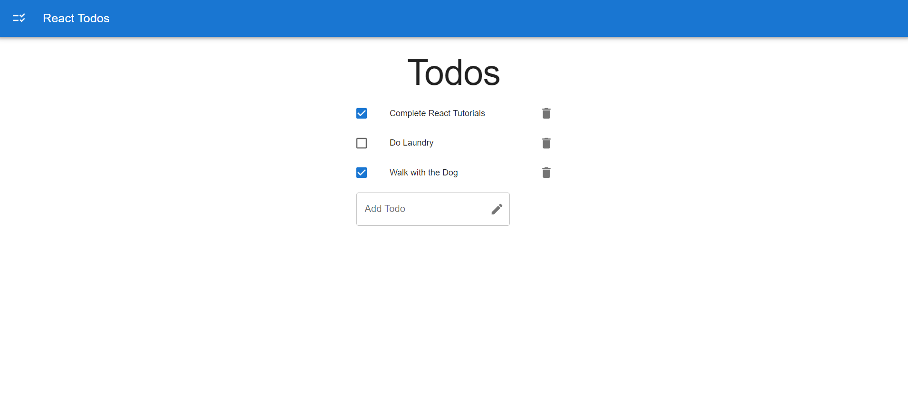

# React Todo App

This is a simple Todo application built using React and Material UI. It allows users to manage their tasks by adding, editing, and marking them as completed. The app is designed to be user-friendly with an intuitive interface.

## Features

- Add new tasks: Users can enter a task description and add it to their todo list.
- Edit tasks: Users can edit the description of existing tasks.
- Mark tasks as completed: Users can mark tasks as completed, indicating that they have been finished.
- Filter tasks: Users can filter their tasks by their completion status (all, active, completed).
- Delete tasks: Users can remove tasks from the todo list.
- Responsive design: The app is fully responsive and works seamlessly across different devices.

## Technologies Used

- React: A JavaScript library for building user interfaces.
- Material UI: A popular React UI framework that provides pre-built components and styling.
- useState hook: This hook is used to manage the state of the todo list and update it when necessary.
- useEffect hook: This hook is used to handle side effects, such as fetching data from an external source (e.g., a GitHub repository) or subscribing to event listeners.

## Acknowledgements

- The React community for creating and maintaining the powerful React library.
- The Material UI team for providing the elegant UI components.
- [GitHub](https://github.com) for hosting the repository and enabling collaboration.

## Contact

For any inquiries or feedback, please contact [shakeebparwez@gmail.com](mailto:shakeebparwez@gmail.com).
